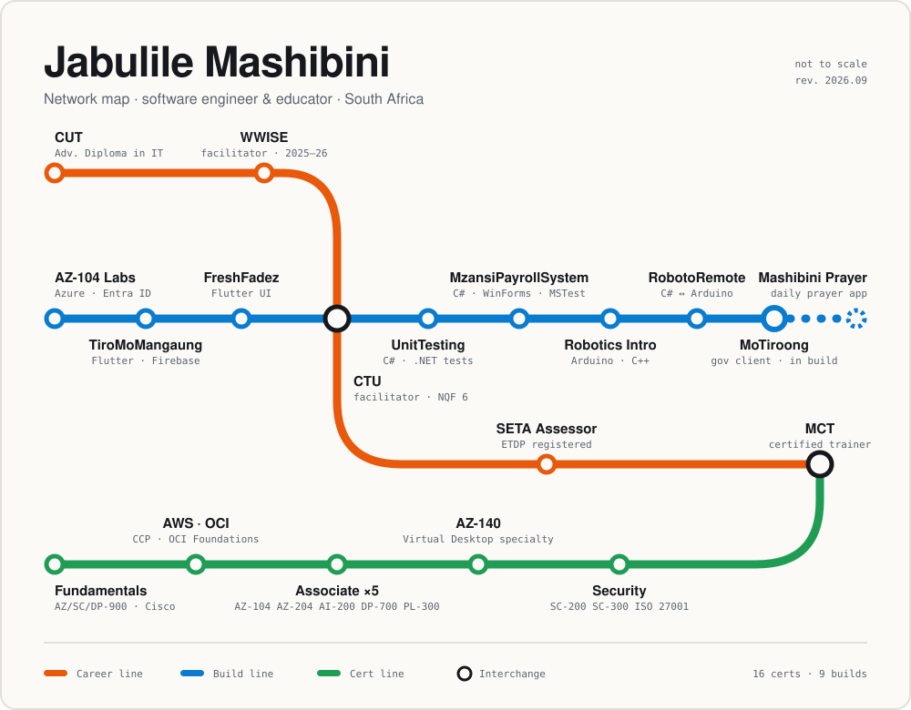

<picture>
  <source media="(prefers-color-scheme: dark)" srcset="assets/map-dark.svg">
  
</picture>

  <a href="https://jabulile1704.github.io/JM-Mashibini-Website-Portfolio-/">Portfolio</a> &nbsp;·&nbsp;
  <a href="https://www.linkedin.com/in/jabulile-mashibini">LinkedIn</a> &nbsp;·&nbsp;
  <a href="mailto:jabu.mashibs@gmail.com">jabu.mashibs@gmail.com</a>

I teach software engineering at CTU Training Solutions and build things in between classes, mostly Flutter on the front with Azure or Firebase behind it. Lately that includes a bit of Arduino too. The map above is roughly how the last couple of years have gone: one line for work, one for things I've built, one for exams.

 

###  &nbsp;Build line

| Station | What it is | Stack |
|:--|:--|:--|
| [**MoTiroong**](https://github.com/Jabulile1704/motiroong-mobile) | Staff clock-ins for Mangaung Metro Municipality. Location and fingerprint both have to match, with fallbacks for people whose prints have worn down from manual work. Split across [backend](https://github.com/Jabulile1704/motiroong-backend) and [admin](https://github.com/Jabulile1704/admin-motiroong) repos. | Flutter · Firebase · Cloud Functions · Next.js |
| [**RobotoRemote**](https://github.com/Jabulile1704/RobotoRemote) | A desktop remote for an Arduino Uno. Toggles four LEDs on a breadboard over USB serial, in real time. | C# · WinForms · Arduino |
| [**Robotics Intro**](https://github.com/Jabulile1704/Robotics_Intro) | Non-blocking Arduino state machine. Tap to start, double-tap to stop, hold two seconds to reset. Servo sweep, ultrasonic distance and an LCD countdown. | C++ · Arduino |
| [**MzansiPayrollSystem**](https://github.com/Jabulile1704/MzansiPayrollSystem) | A Windows Forms payroll system covered by unit, integration and system tests. | C# · WinForms · MSTest |
| [**UnitTesting**](https://github.com/Jabulile1704/UnitTesting-Exercise) | Unit testing exercises: assertions, automated tests and checking what the code actually does. | C# · .NET |
| [**FreshFadez**](https://github.com/Jabulile1704/fresh_fadez) | Salon booking app. Services, stylists and appointments in an animated UI. Backend is next. | Flutter · Dart |
| [**TiroMoMangaung**](https://github.com/Jabulile1704/TiroMoMangaung) | A job board for Mangaung that tells you how far each job is from you. CV uploads, push notifications, application tracking and an admin dashboard. | Flutter · Firebase |
| [**AZ-104 Labs**](https://github.com/Jabulile1704/azure-virtual-networking) | Azure admin labs covering identity, governance, compute, storage and networking, written up so someone else can follow them. | Azure · Entra ID |
| [**Mashibini Prayer**](https://github.com/Jabulile1704/Mashibini-Prayer) | A daily prayer app. Early days, still being built. | Flutter · Firebase |

 

###  &nbsp;Career line

**CTU Training Solutions** · Software Engineering Facilitator, NQF Level 6 · *now*\
C#, Java, ASP.NET and .NET, software design and testing. I also run the Git/GitHub workflow sessions and AZ-204 bootcamp labs, do code reviews and mentor learner projects.

**WWISE** · Software Development Facilitator · *2025 – 2026*\
Python, JavaScript, HTML/CSS, SQL and web APIs, plus Power BI and PowerApps.

**Central University of Technology** · Advanced Diploma in Information Technology (2024 – 2025) · Diploma in Information Technology (2020 – 2023)

Microsoft Certified Trainer and registered ETDP SETA assessor.

 

###  &nbsp;Cert line

| Stop | Certifications |
|:--|:--|
| Fundamentals | AZ-900 · SC-900 · DP-900 · Cisco Python Essentials 1 & 2 |
| Associate | AZ-104 Azure Administrator · AZ-204 Azure Developer · AI-200 Azure AI Cloud Developer · DP-700 Fabric Data Engineer · PL-300 Power BI Data Analyst |
| Specialty | AZ-140 Azure Virtual Desktop |
| Security | SC-200 Security Operations Analyst · SC-300 Identity and Access Administrator · ISO/IEC 27001:2022 Implementation |
| Other clouds | AWS Certified Cloud Practitioner · Oracle Cloud Infrastructure Foundations |
| Trainer | MCT Microsoft Certified Trainer |

 

**Rolling stock** &nbsp; C# · ASP.NET Core · Java · Dart/Flutter · Python · JavaScript · SQL · PostgreSQL · Firebase · Azure · AWS · GitHub Actions · Arduino · Linux

**Now boarding** &nbsp; CI/CD with GitHub Actions and Azure DevOps · clean architecture in Flutter · cloud security

 

Change here for collaborations, especially cloud-native or community projects &nbsp;→&nbsp; <a href="mailto:jabu.mashibs@gmail.com">jabu.mashibs@gmail.com</a>

